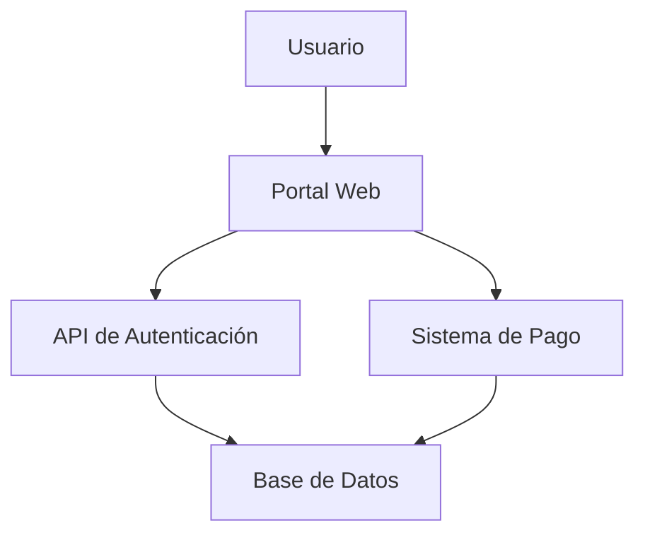

# Especificación de Ingesta y Parsing de Información Técnica

## 1. Objetivo

Definir los requisitos para un sistema capaz de ingerir, normalizar y parsear información técnica variada: diagramas, descripciones, especificaciones, UML, DFD y texto libre. El sistema debe extraer componentes, flujos de datos, actores y entidades con claridad y consistencia.

## 2. Alcance

El sistema debe soportar:
- Diagramas en formatos textuales o semiestructurados (UML, DFD, BPMN, etc.).
- Descripciones narrativas de sistemas, procesos, servicios e interacciones.
- Especificaciones funcionales y no funcionales.
- Modelos y diagramas definidos en notaciones comunes.

No incluye:
- Renderizado gráfico de diagramas.
- Traducción automática de idiomas.
- Ejecución de modelos.

## 3. Fuentes de entrada

El sistema debe aceptar:
- Texto plano con especificaciones y descripciones.
- Archivos estructurados en formatos comunes (JSON, YAML, XML, Markdown).
- Contenido exportado de herramientas de modelado (PlantUML, Mermaid, etc.).
- Diagramas en texto con notaciones DFD/UML.

## 4. Proceso general

### 4.1 Ingesta

1. Recepción de contenido desde distintas fuentes.
2. Detección del tipo de documento o diagrama.
3. Validación mínima del formato.

### 4.2 Normalización

1. Limpieza de texto (remover ruido, caracteres especiales innecesarios, espacios extra).
2. Homogeneización de notación para facilitar el parseo.
3. Identificación de bloques lógicos: diagramas, secciones, listas, descripciones.

### 4.3 Identificación del formato

Detectar si la entrada corresponde a:
- UML (casos de uso, clases, secuencia, componentes, estados).
- DFD (procesos, flujos, almacenes de datos, terminadores).
- Diagrama de componentes o arquitectura.
- Descripción narrativa.
- Especificación mixta.

### 4.4 Extracción de elementos

Para cada formato, extraer:
- Componentes / módulos / sistemas.
- Entidades de datos y objetos de negocio.
- Actores / usuarios / roles.
- Flujos de datos / interacciones / dependencias.
- Interfaces, entradas y salidas.

## 5. Estructura de salida esperada

El resultado debe generar archivos separados para diferentes propósitos:

- **output.json**: Modelo intermedio uniforme en JSON para validación automática y procesamiento posterior. Incluye las categorías principales.
- **resumen.md**: Documento Markdown con descripción de alto nivel, tablas de componentes, actores, entidades y flujos para validación humana.
- **diagrama.mermaid**: Diagrama generado en formato Mermaid para visualización de la arquitectura extraída.
- **faltantes.md**: Lista de información faltante o inconsistencias detectadas, en formato Markdown para revisión humana.

### 5.1 output.json

Estructura JSON uniforme:

```json
{
  "componentes": ["Portal Web", "API de Autenticación", "Base de Datos"],
  "actores": ["Usuario", "Administrador", "Sistema de Pago"],
  "entidades": ["Cuenta", "Transacción", "Producto"],
  "flujos": [
    {"origen": "Usuario", "destino": "Portal Web", "tipo": "solicitud"},
    {"origen": "API de Autenticación", "destino": "Base de Datos", "tipo": "consulta"}
  ],
  "servicios": ["Autenticación", "Pago", "Consulta de Datos"],
  "contexto": ["Asumimos que la base de datos es PostgreSQL", "Restricción: Solo usuarios registrados"]
}
```

### 5.2 resumen.md

Documento Markdown con tablas y descripciones:

```markdown
# Resumen de Arquitectura Extraída

Este sistema representa una plataforma de e-commerce con autenticación y pagos.

## Actores
| Nombre | Descripción |
|--------|-------------|
| Usuario | Cliente que navega y compra productos |
| Administrador | Gestiona el catálogo y usuarios |
| Sistema de Pago | Procesa transacciones externas |

## Componentes
| Nombre | Tipo | Descripción |
|--------|------|-------------|
| Portal Web | Interfaz | Frontend para usuarios |
| API de Autenticación | Servicio | Valida credenciales |
| Base de Datos | Almacén | Persiste datos |

## Flujos de Datos
| Origen | Destino | Tipo | Descripción |
|--------|---------|------|-------------|
| Usuario | Portal Web | Solicitud HTTP | Navegación y login |
| Portal Web | API de Autenticación | Llamada API | Validación de usuario |
| API de Autenticación | Base de Datos | Consulta SQL | Verificación de credenciales |
```

### 5.3 diagrama.mermaid

Diagrama Mermaid generado:



### 5.4 faltantes.md

Lista de faltantes e inconsistencias:

```markdown
# Información Faltante e Inconsistencias

## Faltantes
- No se especifica el protocolo de comunicación entre Portal Web y API de Autenticación (¿REST, GraphQL?).
- Falta definir el esquema de la Base de Datos (tablas, relaciones).
- No se menciona manejo de errores o logging.

## Inconsistencias
- El flujo "Usuario -> Sistema de Pago" se menciona pero no se detalla cómo se integra con el Portal Web.
- "Producto" se lista como entidad pero no aparece en ningún flujo.
```

## 6. Ejemplos de Entradas y Salidas

### 6.1 Ejemplo 1: Diagrama DFD en Texto

**Entrada:**
```
DFD Nivel 0:
- Proceso 1: Procesar Pedido
- Almacén 1: Inventario
- Entidad Externa: Cliente
- Flujo: Cliente -> Proceso 1 (Pedido), Proceso 1 -> Almacén 1 (Consulta Stock), Proceso 1 -> Cliente (Confirmación)
```

**Salida Esperada:**
- output.json: JSON con componentes=["Procesar Pedido"], actores=["Cliente"], entidades=["Inventario"], flujos=[...]
- resumen.md: Tabla con actores, componentes, flujos.
- diagrama.mermaid: Grafo con nodos y edges.
- faltantes.md: Posibles faltantes como detalles del proceso.

### 6.2 Ejemplo 2: Descripción Narrativa

**Entrada:**
"El sistema de gestión de biblioteca permite a los usuarios buscar libros, reservarlos y devolverlos. Incluye un módulo de catálogo, un servicio de reservas y una base de datos de libros y usuarios."

**Salida Esperada:**
- output.json: componentes=["Módulo de Catálogo", "Servicio de Reservas", "Base de Datos"], actores=["Usuario"], entidades=["Libro", "Usuario"], flujos=[...]
- resumen.md: Descripción y tablas.
- diagrama.mermaid: Diagrama de la biblioteca.
- faltantes.md: Inconsistencias como falta de autenticación.

### 6.3 Ejemplo 3: UML en PlantUML

**Entrada:**
```
@startuml
class Usuario {
  +login()
}
class Sistema {
  +autenticar()
}
Usuario --> Sistema : autentica
@enduml
```

**Salida Esperada:**
- output.json: componentes=["Sistema"], actores=["Usuario"], entidades=[], flujos=[{"origen":"Usuario","destino":"Sistema","tipo":"autentica"}]
- resumen.md: Tabla de clases y relaciones.
- diagrama.mermaid: Conversión a Mermaid.
- faltantes.md: Faltantes como métodos detallados.
7. Generar siempre un resumen de alto nivel en Markdown con:
   - Una descripción general clara del sistema.
   - Una tabla de actores y componentes descritos por tipo.
   - Una tabla que represente la interoperabilidad entre actores y componentes.

## 7. Requisitos no funcionales

- Precisión: el parser debe minimizar falsos positivos y omitir ruído.
- Robustez: debe tolerar variaciones en estilo y formato.
- Extensibilidad: fácil de adaptar a nuevas notaciones técnicas.
- Rendimiento: procesar documentos de tamaño medio en un tiempo razonable.
- Claridad: la salida debe ser comprensible y utilizable en análisis posteriores.

## 8. Validación

El sistema debe validar:
- Que cada flujo referencie componentes, actores o entidades existentes.
- Que los actores no sean confundidos con entidades de datos.
- Que los componentes principales se identifiquen incluso en descripciones implícitas.
- Que las entidades de datos se extraigan de nombres de objetos, almacenes y mensajes.

## 9. Casos de uso

- Documentar la arquitectura de un sistema a partir de esquemas UML.
- Extraer procesos y responsabilidades desde un DFD.
- Identificar dominios y actores en una especificación narrativa.
- Preparar un modelo de análisis para diseño de software.

## 10. Criterios de éxito

- El sistema identifica correctamente al menos el 90% de componentes y flujos en ejemplos de UML y DFD.
- Las entidades y actores extraídos son coherentes con la descripción del dominio.
- La salida estructurada permite realizar análisis de arquitectura o generación de artefactos.
